# THE HANGMAN

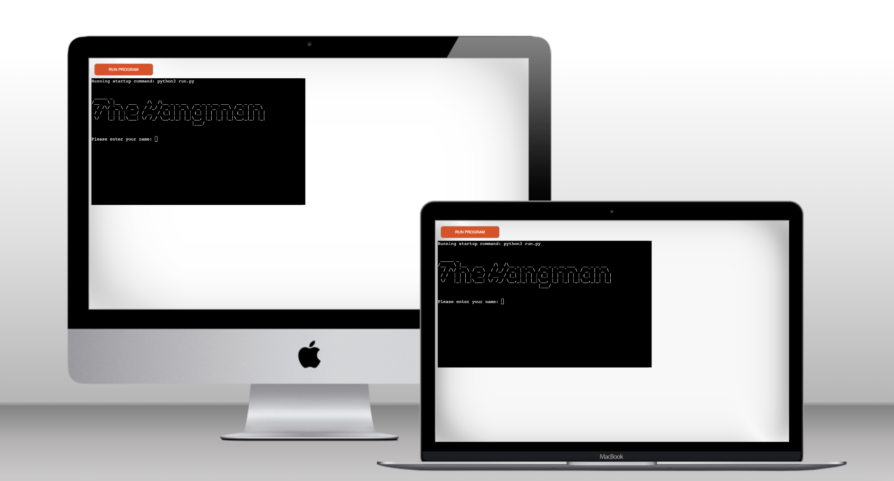

A version of the popular and classic game The Hangman created and played using the command line and the Python programming language which has been deployed with Heroku.

Visit the live site: [The Hangman](https://p03-hangman-ebeea9faff7c.herokuapp.com/)

## CONTENTS

- [AUTOMATED TESTING](#AUTOMATED-TESTING)
  - [Python Linter](#Python-Linter)
  - [Lighthouse](#Lighthouse)
- [MANUAL TESTING](#MANUAL-TESTING)
  - [Testing User Stories](#Testing-User-Stories)
  - [Full Testing](#Full-Testing)
- [BUG TRACKER](#BUG-TRACKER)
  - [Solved Bugs](#Solved-Bugs)
  - [Known Bugs](#known-Bugs)

---

Manual testing was carried out as soon as the project started using exploratory testing techniques and a list of bugs was identified and placed in a table to tackle.
At the same time as building each page, the site was tested using the developer console and printing those results to it, to make sure everything was working taking little steps.
Afterwards, formal test cases were developed and executed.
Automated testing was carried out at a later stage using validators and all errors were fixed, it was checked that all user goals are met and after this, a test case table was created. To finish, the project was shared in Slack for peer review.

## AUTOMATED TESTING

### Python Linter

I used [Python Linter - Pep8CI](https://pep8ci.herokuapp.com/) to test for error, most of the errors returned were related to formatting such as spacing or long lines of code, those were all fixed.

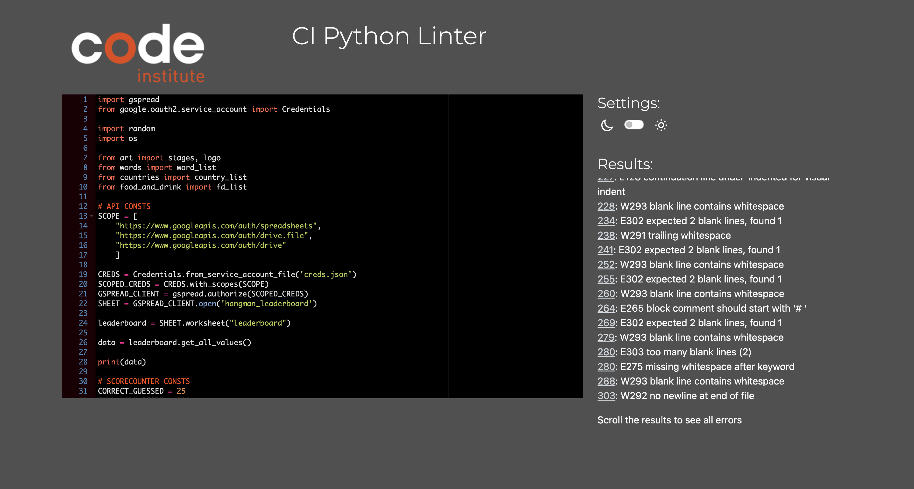

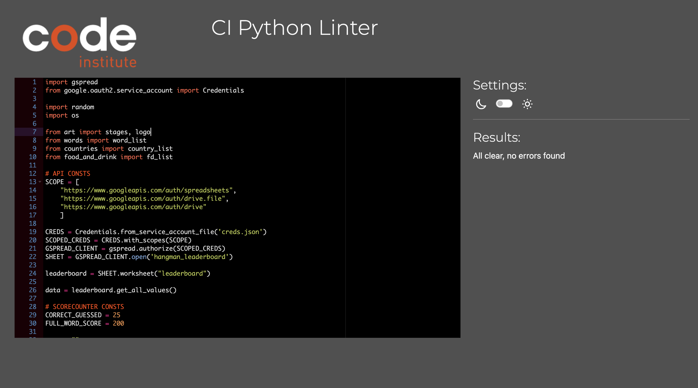

### Lighthouse

I used Lighthouse within the Chrome Developer Tools to test the performance, accessibility, best practices and SEO of the website.

#### Desktop Results

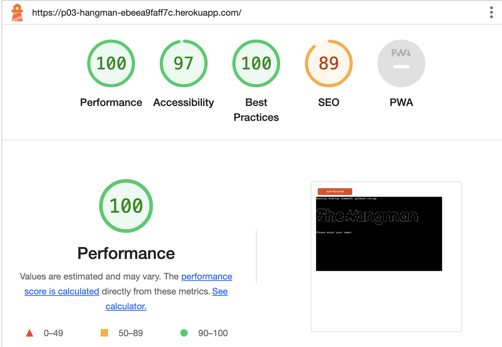

#### Mobile Results

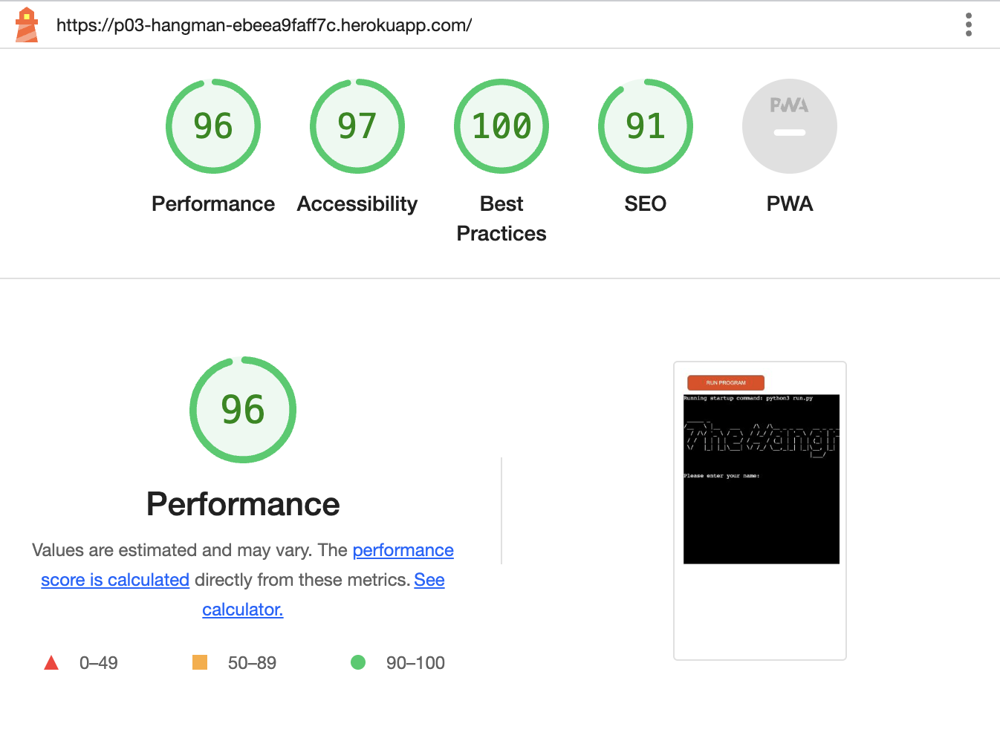

---

---

## MANUAL TESTING

### Testing User Stories

`First-Time Visitors`
| Goals | How are they achieved? |
| :--- | :--- |
| As a first-time visitor, I want to start a new game using the command line. | The user can easily initiate a new game using the console |
| As a first-time visitor, I want to see how many attempts I have left when playing. | There is a feature in which the user is notified how many attempts left are before finishing the game |
| As a first-time visitor, I want to see the words I guessed so far displayed. | The user can see the words guessed correctly as part of the word in the console |
| As a first-time visitor, I want the app to ask me if I want to play again or not when finishing. | The app asks the user whether they would like to continue or start a new game |

`Returning Visitors`
| Goals | How are they achieved? |
| :--- | :--- |
| A- As a returning visitor, I want to see my results. | There is a feature which enables the user to see the results in the leaderboard. |

`Frequent Visitors`
| Goals | How are they achieved? |
| :--- | :--- |
| As a frequent visitor, I want to be able to play the game using different categories. | The game select feature enables the user to select different categories |

### Full Testing

Full testing was performed on the following devices:

- Desktop:
  - Custom Gaming computer (Raven) with 2 screens set up 24 inches and Windows OS
- Laptop:
  - Mac book Pro 2023 14 inches screen and Mac OS
- Android Mobile Devices:
  - Samsung Galaxy S20
  - Samsung Galaxy A50

Each device tested the site using the following browsers:

- Google Chrome
- Safari
- Firefox

### Test Cases

`All pages`
| Feature | Expected Result | Testing Performed | Actual Result | Pass/Fail |
| --- | --- | --- | --- | --- |
| Welcome screen | abc | abc | abc | Pass or Fail |
| Select category | abc | abc | abc | Pass or Fail |
| Score counter | abc | abc | abc | Pass or Fail |
| Leader board | abc | abc | abc | Pass or Fail |

---

## BUG TRACKER

### Solved Bugs

| ID  | CLASS | FEATURE                 | DESCRIPTION                                                                                                                                                                                                                              | STEPS TO REPRODUCE                                                                                                                                                                           | ACTUAL RESULT                                                      | EXPECTED RESULT                                 | ACTION                                                                                                                                                                                                                                                                                                                                                                                                       | STATUS    |
| --- | ----- | ----------------------- | ---------------------------------------------------------------------------------------------------------------------------------------------------------------------------------------------------------------------------------------- | -------------------------------------------------------------------------------------------------------------------------------------------------------------------------------------------- | ------------------------------------------------------------------ | ----------------------------------------------- | ------------------------------------------------------------------------------------------------------------------------------------------------------------------------------------------------------------------------------------------------------------------------------------------------------------------------------------------------------------------------------------------------------------ | --------- |
| 1   | A     | Google sheets save data | Encoding. The results for the player name do not get saved in the google spread. 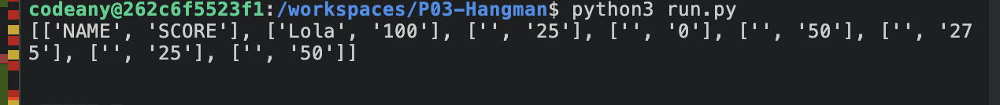 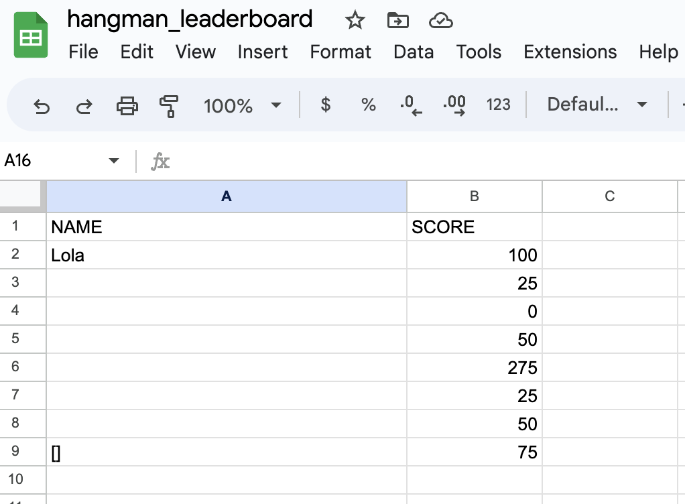 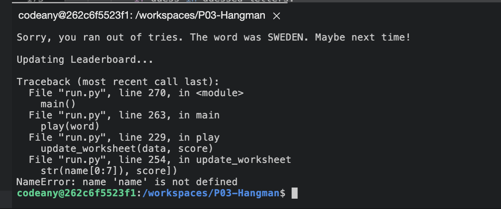 | Start the app > select Play > Enter a name > Observe the issue with the name not being displayed in the google sheet leader board                                                            | The names do not save correctly into google docs but the scores do | The names should be saved as well as the scores | Solution: added the global key to the variable in which the names are being stored called name. The global keyword is required because the function is changing the value of a variable that was defined outside the function. if the global keyword is not used then python will just create a new variable that is only available within that function and this was preventing the name to store properly. | FIXED     |
| 2   | A     | Terminal data display   | Encoding. The letters guessed wrong display incorrectly 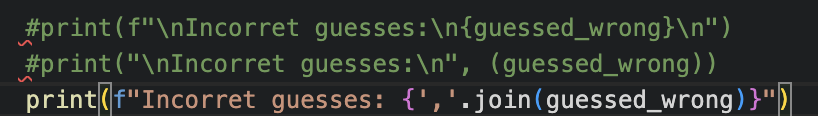 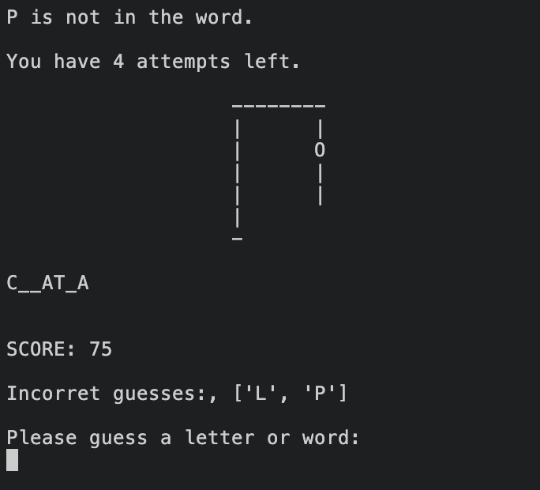                                                                                               | Start the app > select Play > Enter a name > Guess some incorrect letters > Observe the issue with the guesses not displayed correctly in the terminal leader board                          | The letters guessed wrong do not display correctly                 | The letters should display correctly            | Solution: after several tries and printing the results to the console added the join method which fixed the issue                                                                                                                                                                                                                                                                                            | FIXED     |
| 3   | B     | Logo display            | UI. The Hangman logo does not display correctly after deployment. 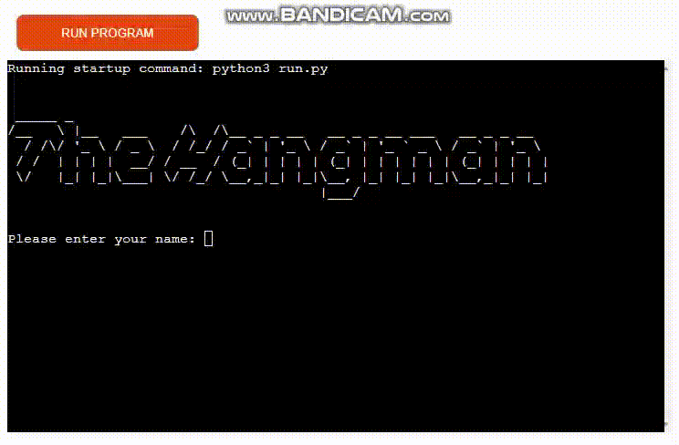 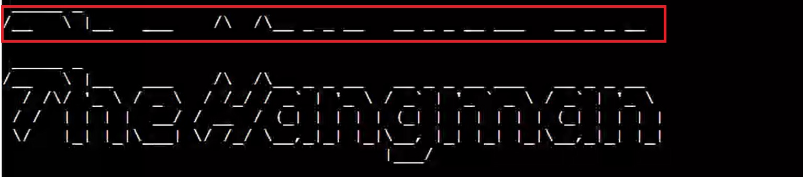                                                                            | Start the app > select Play > Enter a name > Continue playing until a full screen is filled up > Scroll up to see the previous text > Observe the issue in the logo not displaying correctly | The logo does not display correctly                                | The logo should display correctly               | Solution: not found                                                                                                                                                                                                                                                                                                                                                                                          | NOT FIXED |

### Known Bugs

There are no remaining known bugs, all of them have been fixed.

---
