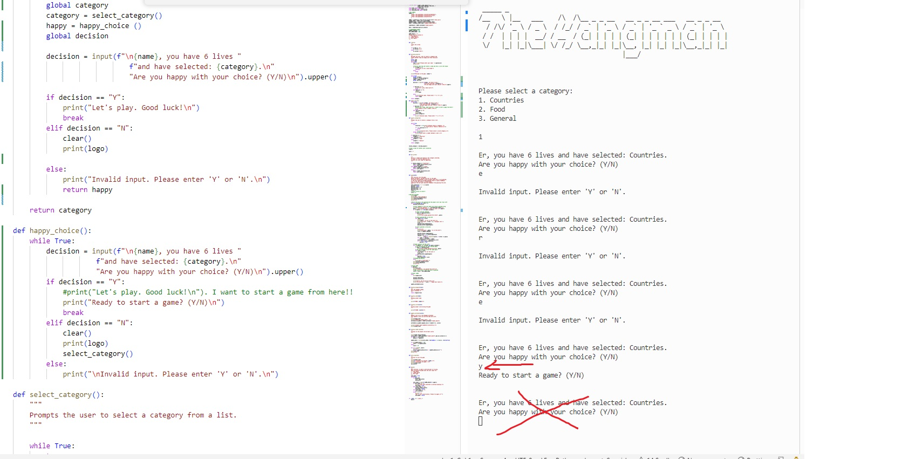

# THE HANGMAN

A version of the popular and classic game The Hangman created and played using the command line and the Python programming language which has been deployed with Heroku.

Visit the live site: [The Hangman](https://p03-hangman-ebeea9faff7c.herokuapp.com/)

## CONTENTS

- [AUTOMATED TESTING](#AUTOMATED-TESTING)
  - [Python Linter](#Python-Linter)
  - [Lighthouse](#Lighthouse)
- [MANUAL TESTING](#MANUAL-TESTING)
  - [Testing User Stories](#Testing-User-Stories)
  - [Full Testing](#Full-Testing)
- [BUG TRACKER](#BUG-TRACKER)
  - [Solved Bugs](#Solved-Bugs)
  - [Known Bugs](#known-Bugs)

---

Manual testing was carried out as soon as the project started using exploratory testing techniques and a list of bugs was identified and placed in a table to tackle.
At the same time as building each page, the site was tested using the developer console and printing those results to it, to make sure everything was working taking little steps.
Afterwards, formal test cases were developed and executed.
Automated testing was carried out at a later stage using validators and all errors were fixed, it was checked that all user goals are met and after this, a test case table was created.
This game was also tested using mobile devices but due to the backend nature of the project, that it is displayed in the console and that it is not a requirement for this project, some of the ASCII are is not responsive for smaller devices, the game logic works equally fine.

## AUTOMATED TESTING

### Python Linter

I used [Python Linter - Pep8CI](https://pep8ci.herokuapp.com/) to test for errors, most of the errors returned were related to formatting such as spacing or long lines of code, those were all fixed.

Python Linter was ignored on art.py as the spaces are needed to form ASCII Art.

### Lighthouse

I used Lighthouse within the Chrome Developer Tools to test the performance, accessibility, best practices and SEO of the website.

#### Desktop Results

#### Mobile Results

---

---

## MANUAL TESTING

### Testing User Stories

`First-Time Visitors`
| Goals | How are they achieved? |
| :--- | :--- |
| As a first-time visitor, I want to start a new game using the command line | The user can easily initiate a new game using the console |
| As a first-time visitor, I want to see how many attempts I have left when playing | There is a feature in which the user is notified how many attempts left are before finishing the game |
| As a first-time visitor, I want to see the words I guessed so far displayed | The user can see the words guessed correctly as part of the word in the console |
| As a first-time visitor, I want the app to ask me if I want to play again or not when finishing | The app asks the user whether they would like to continue or start a new game |

`Returning Visitors`
| Goals | How are they achieved? |
| :--- | :--- |
| As a returning visitor, I want to see my results. | There is a feature which enables the user to see the results in the leader board |

`Frequent Visitors`
| Goals | How are they achieved? |
| :--- | :--- |
| As a frequent visitor, I want to be able to play the game using different categories | The game select feature enables the user to select different categories |

### Full Testing

Full testing was performed on the following devices:

- Desktop:
  - Custom Gaming computer (Raven) with 2 screens set up 24 inches and Windows OS
- Laptop:
  - Mac book Pro 2023 14 inches screen and Mac OS
- Android Mobile Devices:
  - Samsung Galaxy S20
  - Samsung Galaxy A50

Each device tested the site using the following browsers:

- Google Chrome
- Safari
- Firefox

### Test Cases

`All pages`
| Feature | Expected Result | Testing Performed | Actual Result | Pass/Fail |
| --- | --- | --- | --- | --- |
| Logo | The logo is displayed correctly when starting the game | Play the game and observe the logo position | The logo displays usually ok however in some instances it is a bit clipped | Pass with caution |
| Welcome screen | Welcome message is shown and the user can input their name | Entered different names and also entered a blank input | The names display ok in the console and an error message is shown if they user leaves it blank | Pass |
| Play | The user is prompted with the hangman and can input their guesses | Enter different letters, words and incorrect inputs such as numbers | The error handling is working as expected informing the user when entering an invalid input | Pass |
| Select category | The user can select a category to play | Select different categories and use invalid inputs | Working as expected taking the user to the selected category and displaying error messages when the invalid inputs are entered | Pass |
| Score counter | This feature counts the score obtained by the player, adding 25 per letter guessed and 200 per word guessed and displays the data in the terminal | Play the game and observe different results | Working as expected | Pass |
| Game over | When losing a game, the name of the player, score and game over ASCII Art are displayed | Lose a game | All content is displaying as expected | Pass |
| End game | When finishing a game the user is prompted with a screen in which they can decide whether to start a new game, have a look at the leader board, or exit the game. | Finish the game, select all possible different options, and enter incorrect input | The correct options are triggered, incorrect input is handled | Pass |
| Leader board | When finishing the game the user can see the leader board showing the top 10 scores achieved by previous players. | Finish a game and select leader board, observe that the spreadsheet is adding names and scores and those are being returned and arranged in the leader board| The leader board is working as expected | Pass |

---

## BUG TRACKER

### Solved Bugs

| ID  | CLASS | FEATURE                 | DESCRIPTION                                                                                                                                                                                                                            | STEPS TO REPRODUCE                                                                                                                                                                           | ACTUAL RESULT                                                               | EXPECTED RESULT                                 | ACTION                                                                                                                                                                                                                                                                                                                                                                                                                                                                                                    | STATUS                          |
| --- | ----- | ----------------------- | -------------------------------------------------------------------------------------------------------------------------------------------------------------------------------------------------------------------------------------- | -------------------------------------------------------------------------------------------------------------------------------------------------------------------------------------------- | --------------------------------------------------------------------------- | ----------------------------------------------- | --------------------------------------------------------------------------------------------------------------------------------------------------------------------------------------------------------------------------------------------------------------------------------------------------------------------------------------------------------------------------------------------------------------------------------------------------------------------------------------------------------- | ------------------------------- |
| 1   | A     | Google sheets save data | Encoding. The results for the player name do not get saved in the google spread.    | Start the app > select Play > Enter a name > Observe the issue with the name not being displayed in the google sheet leader board                                                            | The names do not save correctly into google docs but the scores do          | The names should be saved as well as the scores | Solution: added the global key to the variable in which the names are being stored called name. The global keyword is required because the function is changing the value of a variable that was defined outside the function. if the global keyword is not used then python will just create a new variable that is only available within that function and this was preventing the name to store properly.                                                                                              | FIXED                           |
| 2   | A     | Terminal data display   | Encoding. The letters guessed wrong display incorrectly                                                                                               | Start the app > select Play > Enter a name > Guess some incorrect letters > Observe the issue with the guesses not displayed correctly in the terminal leader board                          | The letters guessed wrong do not display correctly                          | The letters should display correctly            | Solution: after several tries and printing the results to the console added the join method which fixed the issue                                                                                                                                                                                                                                                                                                                                                                                         | FIXED                           |
| 3   | C     | Logo display            | UI. The Hangman logo does not display correctly after deployment.                                                                            | Start the app > select Play > Enter a name > Continue playing until a full screen is filled up > Scroll up to see the previous text > Observe the issue in the logo not displaying correctly | The logo does not display correctly                                         | The logo should display correctly               | Solution: not found. This bug has a low repro rate being reproduced only in certain occasions.                                                                                                                                                                                                                                                                                                                                                                                                            | NOT FIXED (Passed with caution) |
| 4   | A     | Game logic              | Encoding. The function does not start the game when pressing "Y".                                                                                                                         | Start the app > select Play > Enter a name > Select a category> Type "Y" in response to "Are you happy to continue?"> Observe the issue with the game not starting                           | The game displays an incorrect message when answering "Y" to start the game | The game should start when selecting "Y"        | Solution: There was a a while loop inside a while loop and there was something that ran in the first while loop but not the second but after the second while loop was completed. To solve this, the last function added happy_choice() with the purpose of looping trough "Are you happy with your choice?" while the user has not entered a correct input, was adjusted and decision = happy_choice() was reassigned, after troubleshooting and some adjustments within that area, the issue was solved | FIXED                           |

### Known Bugs

Bug number 3 remains unfixed as this was difficult to reproduce at times and did not affect the game, the logo also doesn't display correctly in smaller screen sizes, but considering the display of this game is done in the terminal and no layout settings are available to reduce font sizes and that this is not a requirement for this project this was left as it is, the important part relies on the the game logic working correctly, which works as expected.

---
